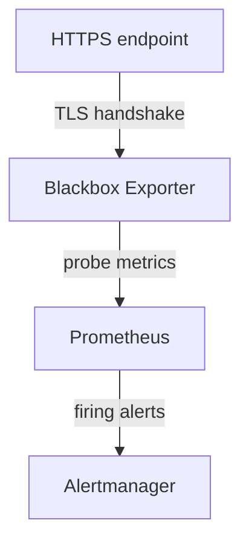

<p align="center">
  <a href="https://digitalis.io">
    
  </a>
</p>

<p align="center">
  <em>Built and maintained by <a href="https://digitalis.io">Digitalis.IO</a></em>
</p>

# Monitoring HTTPS Certificate Expiry with Prometheus and Blackbox Exporter

Monitor TLS certificate expiry automatically with Prometheus and Blackbox Exporter using a local Docker Compose stack.

## Quick Start

```bash
git clone https://github.com/digitalis-io/blog-https-prom-cert-blackbox-exporter
cd blog-https-prom-cert-blackbox-exporter
./generate-certs.sh 30
docker compose up -d
```

| Service | URL |
|---|---|
| Prometheus | http://localhost:9090 |
| Alertmanager | http://localhost:9093 |
| Blackbox Exporter | http://localhost:9115 |
| NGINX (HTTPS) | https://localhost:8443 |

## Why monitor certificate expiry

HTTPS encrypts traffic between clients and servers. Without it, credentials, API tokens, and anything else on the wire is exposed to interception or tampering.

Most of the ecosystem now assumes it. Browsers flag plain HTTP as insecure, API clients reject untrusted endpoints, and search engines treat HTTPS as a ranking signal.

At the core of HTTPS is the TLS certificate, typically an X.509 cert signed by a Certificate Authority (CA). Certificates have a fixed validity period and can also be revoked before that. Renewing one in a real organisation usually involves through multiple teams and approval steps, with lead times measured in days or weeks rather than minutes.

The critical risk is that expiry is silent. There is no degraded state. The cert is valid until it isn't, and then the service stops working. Browser warnings appear, integrations break, and what should have been a routine renewal turns into an after-hours incident.

Monitoring expiry catches this in advance. The rest of the article builds a small Prometheus and Blackbox Exporter stack that does exactly that.

## What you will learn from this walkthrough

* monitor HTTPS certificate expiry
* expose TLS and probe metrics with Blackbox Exporter
* configure Prometheus to scrape and evaluate them
* alert on expiry through Alertmanager
* run the whole stack locally with Docker Compose

## What we are going to build

Four containers wired together:

1. An NGINX server on `localhost:8443` serving HTTPS, with a cert signed by a local CA we generate ourselves. Using a private CA means we control validity dates and can trigger expiry on demand without waiting on a real renewal.
2. Prometheus Blackbox Exporter (referred to as *Blackbox Exporter* from here on) probing the endpoint, doing a full TLS handshake against the local CA and exposing probe and certificate metrics.
3. Prometheus scraping those metrics on an interval. The one that matters here is the certificate expiry timestamp.
4. Prometheus Alertmanager (*Alertmanager* from here on) receiving firing alerts from Prometheus and, in a real deployment, routing them somewhere actionable.


In practical terms, the flow works as follows:
* the HTTPS endpoint exposes the certificate
* Blackbox Exporter performs the TLS handshake and extracts certificate details
* Prometheus stores and evaluates the resulting metrics
* Alertmanager notifies us before the certificate expires

This architecture provides a simple but production-relevant example of how certificate monitoring can be automated to reduce operational risk and prevent avoidable outages.

## Implementation walkthrough

The full project is avaliable at [https-prom-cert-blackbox-exporter](https://github.com/axonops/https-prom-cert-blackbox-exporter). Clone it and bring the stack up from the repo root:
``` shell
docker compose up -d
```

> Note:
> The repo does **not** ship with TLS material. Private keys don't belong in a public repo. Before the first `docker compose up`, generate a local CA and server certificate:
>
> ```bash
> ./generate-certs.sh 30
> ```
>
> That creates `certs/` with a CA and a server certificate valid for 30 days. Re-run it (optionally with a different number of days) whenever you need to refresh the material. `./generate-certs.sh 1` is handy later on to trigger the expiry alert quickly.

### Step 1 - Create the target HTTPS service

The first component we need is a simple HTTPS endpoint that will act as the monitoring target.
NGINX serving a static page over HTTPS. The service in `docker-compose.yml`:

``` yaml
services:
  web:
    image: nginx:1.30
    restart: unless-stopped
    volumes:
      - ./nginx.conf:/etc/nginx/nginx.conf:ro
      - ./certs:/etc/nginx/certs:ro
      - ./index.html:/usr/share/nginx/html/index.html:ro
    ports:
      - "8443:8443"
```

The mounts give it the NGINX config, the generated TLS material, and a one-line HTML page. Port 8443 avoids privileged-port binding while still signalling HTTPS to the reader.

#### Configure NGINX for HTTPS

`nginx.conf` is deliberately minimal:
```
events {}

http {
    server {
        listen 8443 ssl;
        server_name web localhost;

        ssl_certificate     /etc/nginx/certs/server.crt;
        ssl_certificate_key /etc/nginx/certs/server.key;

        ssl_protocols TLSv1.2 TLSv1.3;
        ssl_prefer_server_ciphers on;

        location / {
            root /usr/share/nginx/html;
            index index.html;
        }
    }
}
```

`server_name` covers both `web` (service-to-service traffic on the Compose network) and `localhost` (testing from the host). Only TLS 1.2 and 1.3 are accepted.

#### Add a simple test page

The "application" is one line:
``` html
<!DOCTYPE html>
<html><body><h1>Hello, HTTPS!</h1></body></html>
```

We just need something for TLS to terminate against.

#### Validate the HTTPS endpoint

Sanity-check that TLS works before bolting monitoring on top.

> Note: run the commands below from the repository root, so the relative `certs/` path resolves correctly.

``` bash
curl -v --cacert certs/ca.crt https://localhost:8443
```

Or look at the certificate directly:

``` bash
openssl s_client -connect localhost:8443 -CAfile certs/ca.crt
```

Both confirm the server is reachable, the handshake succeeds, and the chain validates against the local CA.

**Note**: a browser hitting `https://localhost:8443` will still warn about an untrusted cert unless you import `ca.crt` into your system trust store. Expected in a lab.

### Step 2 - Add Blackbox Exporter

Blackbox Exporter acts as an external client: it opens a connection to a target, completes the TLS handshake, and exposes the result as Prometheus metrics. That handshake is exactly what we need to read the certificate.

#### Define the Blackbox Exporter service

Add to `docker-compose.yml`:
```yaml
  blackbox-exporter:
    image: prom/blackbox-exporter:v0.28.0
    restart: unless-stopped
    depends_on:
      - web
    command: ['--config.file=/etc/blackbox_exporter/blackbox.yml']
    volumes:
      - ./blackbox.yml:/etc/blackbox_exporter/blackbox.yml:ro
      - ./certs:/etc/blackbox_exporter/certs:ro
    ports:
      - "9115:9115"
```

`depends_on` makes Compose bring `web` up first so the exporter has something to probe at boot. We use the same pattern across the rest of the stack to keep startup ordered. The exporter listens on 9115 for Prometheus to scrape. The mounts give it the probe config and the local CA so it can validate our cert chain.

#### Configure the Blackbox probe

`blackbox.yml` defines how the probe behaves:
```yaml
modules:
  https_2xx:
    prober: http
    timeout: 5s
    http:
      method: GET
      fail_if_not_ssl: true
      preferred_ip_protocol: ip4
      tls_config:
        ca_file: /etc/blackbox_exporter/certs/ca.crt
```

This defines a module called `https_2xx`: an HTTP probe with TLS validation enabled.

The parameters:

* `prober: http` uses the HTTP prober. TLS is negotiated automatically when the target URL is `https://`.
* `fail_if_not_ssl: true` fails the probe if the target is plain HTTP. Stops a misconfigured target from silently passing on the TLS side.
* `preferred_ip_protocol: ip4` pins to IPv4. Avoids ambiguity in environments where IPv6 is half-configured.
* `tls_config.ca_file` is the CA the exporter trusts when validating the server cert.

The `ca_file` line is the one that actually matters here. Our cert is signed by a private CA, so the exporter has to be told about it explicitly. Without it the handshake fails and no certificate metrics get emitted. In production with a public CA (Let's Encrypt, DigiCert, etc.) you can drop `tls_config` entirely and rely on the system trust store.

#### Validate the probe

Hit the exporter directly:
```
http://localhost:9115/probe?target=https://web:8443&module=https_2xx
```

The output should include `probe_success`, `probe_http_ssl`, and `probe_ssl_earliest_cert_expiry`. The last one is the certificate expiry as a Unix timestamp and is what we will alert on.

> Note:
> `probe_ssl_earliest_cert_expiry` is the legacy expiry metric and is perfect for this walkthrough. Recent versions of Blackbox Exporter also expose `probe_ssl_last_chain_expiry_timestamp_seconds`, alongside a companion `probe_ssl_last_chain_info` info-metric carrying subject, issuer, and fingerprint labels. In production, where you may want to alert per certificate chain or label-join on issuer, prefer the newer metrics.

### Step 3 - Configure Prometheus

Prometheus scrapes the exporter on an interval and evaluates the results.

#### Define the Prometheus service

In `docker-compose.yml`:
```yaml
  prometheus:
    image: quay.io/prometheus/prometheus:v3.11.2
    restart: unless-stopped
    depends_on:
      - blackbox-exporter
      - alertmanager
    ports:
      - "9090:9090"
    command:
      - '--config.file=/etc/prometheus/prometheus.yml'
      - '--storage.tsdb.path=/prometheus'
    volumes:
      - ./prometheus.yml:/etc/prometheus/prometheus.yml:ro
      - ./alert-rules.yml:/etc/prometheus/alert-rules.yml:ro
      - prometheus:/prometheus

volumes:
  prometheus: {}
```

Prometheus listens on 9090. The mounts give it the scrape config (`prometheus.yml`), the rules file (`alert-rules.yml`), and a named volume for the TSDB so data survives container restarts.

#### Configure scraping via Blackbox Exporter

`prometheus.yml`:
```yaml
global:
  scrape_interval: 15s
  evaluation_interval: 15s

scrape_configs:
  - job_name: blackbox-https
    metrics_path: /probe
    params:
      module: [https_2xx]

    static_configs:
      - targets:
          - https://web:8443

    relabel_configs:
      - source_labels: [__address__]
        target_label: __param_target

      - source_labels: [__param_target]
        target_label: instance

      - target_label: __address__
        replacement: blackbox-exporter:9115
```

`global` sets how often Prometheus scrapes (`scrape_interval`) and how often it evaluates rules (`evaluation_interval`).

The `scrape_configs` block defines a job `blackbox-https` that uses the `https_2xx` module to probe our HTTPS endpoint. The unusual bit is that Prometheus isn't talking to the target directly. The flow is:
```
Prometheus -> Blackbox Exporter -> HTTPS endpoint
```
Prometheus scrapes the exporter, and the exporter probes the target.


#### How relabeling works

The end-result URL Prometheus needs to hit is:
```
http://blackbox-exporter:9115/probe?target=https://web:8443&module=https_2xx
```

The three relabel steps build that.

Step 1 - Pass the target as a parameter
```yaml
- source_labels: [__address__]
  target_label: __param_target
```
The target `https://web:8443` gets copied into a `__param_target` label. Labels prefixed with `__param_` become URL query parameters, so this produces:
```
?target=https://web:8443
```

Step 2 - Preserve the instance label
```yaml
- source_labels: [__param_target]
  target_label: instance
```
Without this, every metric would carry `instance="blackbox-exporter:9115"` and you couldn't tell endpoints apart.

Step 3 - Redirect the scrape to the exporter
```yaml
- target_label: __address__
  replacement: blackbox-exporter:9115
```
The scrape address is rewritten to point at the exporter. From here on, Prometheus connects to the exporter and not directly to the HTTPS endpoint.

> Note:
> One hardcoded target in `static_configs` is fine for this walkthrough. In production you'd extend the `targets:` list, or, for a dynamic inventory managed outside of `prometheus.yml`, switch to `file_sd_configs` or another service-discovery mechanism. The relabel block works the same regardless of how targets get fed in.

#### Validate Prometheus

You can access the UI at `http://localhost:9090`. The Targets page should show the `blackbox-https` job UP.
### Step 4 - Configure alerting with Alertmanager

Prometheus evaluates the alert rules. Alertmanager receives firing alerts and, in real deployments, routes them somewhere actionable.

#### Define the Alertmanager service

```yaml
  alertmanager:
    image: quay.io/prometheus/alertmanager:v0.32.0
    restart: unless-stopped
    ports:
      - "9093:9093"
```

Alertmanager listens on 9093.

#### Configure Prometheus alerting

Add to `prometheus.yml`:
```yaml
rule_files:
  - /etc/prometheus/alert-rules.yml

alerting:
  alertmanagers:
    - static_configs:
        - targets:
            - alertmanager:9093
```

`rule_files` tells Prometheus where to load alert and recording rules from. `alerting` points it at the Alertmanager instance to forward firing alerts to. Prometheus handles evaluation, Alertmanager handles delivery.

#### Define the alert rule

`alert-rules.yml`:
```yaml
groups:
  - name: certificate-alerts
    rules:
      - alert: SSLCertificateExpiringSoon
        expr: probe_ssl_earliest_cert_expiry > 0 and (probe_ssl_earliest_cert_expiry - time()) / 86400 < 30
        for: 1m
        labels:
          severity: warning
        annotations:
          summary: "SSL certificate expiring soon"
          description: "Certificate for {{ $labels.instance }} expires in less than 30 days."

      - alert: BlackboxProbeFailed
        expr: probe_success == 0
        for: 5m
        labels:
          severity: critical
        annotations:
          summary: "Blackbox probe failing for {{ $labels.instance }}"
          description: "Probe has been failing for 5+ minutes. The endpoint is unreachable or its TLS handshake is broken (expired certificate, hostname mismatch, untrusted CA, ...)."
```

`SSLCertificateExpiringSoon` is the heart of this article. It uses `probe_ssl_earliest_cert_expiry`, the certificate expiry as a Unix timestamp. The expression:
```
(probe_ssl_earliest_cert_expiry - time()) / 86400
```
gives days remaining. `time()` is the current Unix timestamp, subtracting gives remaining lifetime in seconds, dividing by 86400 converts to days. The alert fires when that drops below 30. `for: 1m` makes sure the condition holds across at least one full evaluation window before firing.

`BlackboxProbeFailed` is a small but important safety net. Blackbox Exporter only emits `probe_ssl_earliest_cert_expiry` when the TLS handshake actually completes. If the certificate has *already* expired (or the hostname doesn't match, or the CA is no longer trusted), the expiry alert above goes silent exactly when you most need it. Alerting on `probe_success == 0` catches that case so a broken endpoint never goes unnoticed.

#### Validate alerting

Two UIs:

* Alertmanager: `http://localhost:9093`
* Prometheus Alerts: `http://localhost:9090/alerts`

If the cert is below the threshold, the alert will show as firing. To force that quickly, regenerate certs with 1 or 2 days of validity (see *Simulate certificate expiration* below).

### Notes on the approach

Blackbox Exporter doesn't read certificate files from disk. It opens a real connection, does the full TLS handshake, and pulls cert metadata out of that exchange. Hostname matching, trust chains, and validity all get evaluated the same way a real client would see them. If something is wrong end-to-end, the probe sees it.

Prometheus stores the resulting expiry timestamp and compares it against `time()` on each evaluation. Alertmanager handles delivery, so routing and grouping can change without touching the rules. Standard probe / evaluate / notify split.

### Validate the end-to-end setup

A quick walk through the running stack.

#### Check Prometheus targets

`http://localhost:9090/targets`. The `blackbox-https` job should be UP.

#### Query probe metrics

In the Prometheus UI (/graph), run:
```promql
probe_success
```
Should return 1.

```promql
(probe_ssl_earliest_cert_expiry - time()) / 86400
```
Returns the number of days remaining on the cert.

#### Check alert status

`http://localhost:9090/alerts`. If the cert is above the threshold the alert is inactive.

#### Verify Alertmanager

`http://localhost:9093` should be reachable and show an empty alerts list until something fires.

### (Optional) Simulate certificate expiration

Regenerate with one day of validity:
```shell
./generate-certs.sh 1
```
Restart the stack so NGINX picks up the new cert:
```shell
docker compose restart
```
Within one or two evaluation cycles the alert flips to firing in Prometheus and lands in Alertmanager.

## Troubleshooting

Common ways this stack breaks.

### Probe fails (`probe_success` = 0)

**Symptoms**

* `probe_success` returns 0
* No TLS metrics (e.g. `probe_ssl_earliest_cert_expiry`)
* Prometheus target may still show UP

**Cause**

Usually a missing scheme on the probe target:
```
target=web:8443
```
instead of:
```
target=https://web:8443
```

**Solution**

Make sure the target is fully qualified: `https://web:8443`.

### No certificate metrics returned

**Symptoms**

* `probe_success` is 0 or 1, but no `probe_ssl_*` metrics
* `probe_http_ssl` = 0

**Cause**

The handshake isn't happening, either because the target isn't HTTPS or the connection never completes.

**Solution**

* Check `fail_if_not_ssl: true` is set in `blackbox.yml`
* Make sure the target starts with `https://`
* Confirm the endpoint is actually serving TLS (`openssl s_client` is the fastest check)

### TLS verification fails (self-signed certificate)

**Symptoms**

* `probe_success` = 0
* Certificate validation errors in the exporter logs

**Cause**

Blackbox Exporter doesn't trust the private CA.

**Solution**

Make sure `blackbox.yml` references the CA:
```yaml
tls_config:
  ca_file: /etc/blackbox_exporter/certs/ca.crt
```
And that the directory is mounted in `docker-compose.yml`:
```yaml
- ./certs:/etc/blackbox_exporter/certs:ro
```
Don't reach for `insecure_skip_verify` outside deliberate failure testing. It papers over the exact problems you're trying to monitor for.

### Target works locally but fails in Blackbox

**Symptoms**

* `curl https://localhost:8443` works on the host
* Blackbox probe fails

**Cause**

Inside the exporter container, `localhost` is the container itself, not the host or any other service.

**Solution**

Use the Compose service name:
```
https://web:8443
```
Compose handles internal DNS resolution.

### Prometheus target shows DOWN

**Symptoms**

* Target DOWN in `http://localhost:9090/targets`

**Cause**

Prometheus can't reach the exporter. Usually:

* wrong service name (`blackbox` vs `blackbox-exporter`)
* wrong port
* exporter container isn't running

**Solution**

Check the scrape address is `blackbox-exporter:9115` and the container is up:
```shell
docker compose ps
```
Also check for port or network conflicts.

### All targets look identical in Prometheus

**Symptoms**

* `instance` is `blackbox-exporter:9115` for every metric
* Can't tell endpoints apart

**Cause**

The relabel step that copies the original target into `instance` is missing:
```yaml
- source_labels: [__param_target]
  target_label: instance
```

**Solution**

Add it back. Without it every metric looks like it came from the exporter itself.

### Alert does not fire

**Symptoms**

* Metrics show the certificate is close to expiry
* No alert in Prometheus or Alertmanager

**Cause**

* Cert is still above the threshold
* Rule file isn't loaded
* Evaluation hasn't run yet
* Alertmanager target isn't reachable

**Solution**

Check the rules are loaded under `http://localhost:9090/rules`. Run the expression directly:
```promql
(probe_ssl_earliest_cert_expiry - time()) / 86400
```
Confirm the threshold is what you expect (e.g. `< 30`) and that the Alertmanager endpoint is reachable from the Prometheus container.

### Browser shows "certificate not trusted"

**Symptoms**

* Browser warning when visiting `https://localhost:8443`

**Cause**

The cert is signed by a private CA the browser doesn't trust.

**Solution**

Expected in a lab. Either click through, or import `ca.crt` into the system trust store.

## Production considerations

The setup here optimises for being reproducible on a laptop. A few things worth thinking about for real environments.

### Use a proper trust model

Real certificates come from a trusted CA. Public services usually use a public CA (Let's Encrypt, DigiCert). Internal services either use a private CA via an internal PKI, or run everything through a public CA. Either way, the monitoring stack has to trust the issuer.

Don't disable TLS verification. `insecure_skip_verify` removes the ability to detect the very problems you're trying to monitor for.

### Tune probes and alert thresholds

Defaults rarely survive contact with real traffic. Worth revisiting:

* probe timeouts, against actual network conditions
* scrape interval, against how fast you need detection
* alert thresholds (30 days vs 7 days vs both), against alert fatigue

Bad tuning either gives you too much noise or detection that lands the day before expiry.

### Ensure external visibility

Internal-only probes miss problems users actually hit. For anything public-facing, probe from outside the network too to validate accessibility, DNS, and certificate validity from a real client position.

### Validate the full certificate chain

Expiry isn't the only failure mode. Watch for missing intermediates, broken bundles, and hostname mismatches. Because Blackbox Exporter does a full handshake, all of these surface as probe failures when `tls_config` is set up properly.

### Ensure monitoring system availability

The monitoring stack is itself critical infrastructure. Plan high availability for Prometheus, Blackbox Exporter, and Alertmanager. Otherwise the thing that's meant to warn you about cert problems can go down without anyone noticing.

### Integrate alerting with real workflows

Alerts have to land somewhere a human will read them: email, Slack, Teams, PagerDuty, whatever your on-call uses. Alertmanager's job is to route them. Configure receivers and routing trees properly or the alert is effectively silent.

## Wrapping up

Going through the components one at a time is the point. When something breaks (and at some point it will), you want to know which part to look at first. Copy-pasting the configs without that context is how monitoring stacks end up running for years before anyone realises they've stopped working.

⸻

If you'd like support implementing or scaling this kind of setup, the team at [Digitalis.io](https://digitalis.io/contact-us) has extensive experience in observability, monitoring, and production operations. We support organisations across the full lifecycle, from initial design and implementation to fully managed services that keep systems reliable, secure, and operating over time.

## Contact

This project is maintained by [Digitalis.io](https://digitalis.io). For support, visit [digitalis.io/contact](https://digitalis.io/contact).
